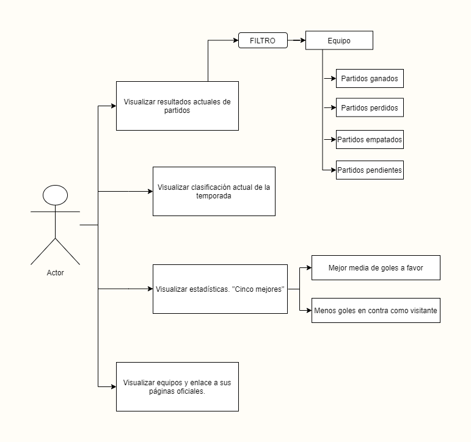

# La Liga Webpage v1.0

La Liga Resultados es una página web de consulta de información de La Liga. Pertenece al segundo proyecto del bootcamp Let's Coder de programación. 

## Descripción Funcional

A través de La Liga Resultados el usuario puede consultar de manera actualizada los resultados de los partidos acontecidos hasta la fecha en la temporada actual, la clasificación de los equipos de fútbol y un ranking de estadísticas de juego de cada equipo. También incluye un filtro en la visualización de los resultados donde se puede seleccionar la información para un equipo de fútbol concreto y mostrar los partidos ganados, perdidos, empatados o pendientes. Además, muestra un panel con todos los equipos de La liga y enlace a sus páginas oficiales.

Las características principales de la página web son las siguientes:
- Visualización de los resultados de todos los partidos de la temporada(jugados y pendientes) junto con fecha y hora.
- Filtrado de todos los partidos para un equipo concreto y selección de parámetros como partidos ganados, perdidos, empatados y pendientes.
- Visualización de la clasificación actual de la temporada con información acumulada de cada equipo.
- Visualización de dos rankings de cinco mejores equipos según estadísticas de los resultados: Mejor media de goles a favor y Menos goles en contra como visitante.
- Enlace a las páginas oficiales de los equipos de fútbol.

### Casos de uso

## Descripción técnica

- addOptions(selectId, array) -> Toma como parámetros la "Id" de input de texto y una array con los equipos de fútbol (teamList(data)). Genera una lista desplegable con todos los equipos para seleccionar en el filtro por equipos.
- teamList(data) -> Toma como parámetro el objeto .json transformado a .js referente a "matches". Devuelve una array con todos los equipos.
- resultTable(data) -> Toma como parámetro el objeto .json transformado a .js referente a "matches". Genera la tabla de resultados según los filtros aplicados.
- filters(data) -> Toma como parámetro "data" de resultTable (función interna). Devuelve una array de objetos "filteredTable" que será usada por resultTable para generar la tabla.

 - tablaClasificacion(data) Toma como parámetro el objeto .json transformado a .js referente a "standings". Genera la tabla de clasificación a partir de los datos de "data".

- estadistica(data) Toma como parámetro el objeto .json transformado a .js referente a "matches". Genera dos arrays (arrayaverage y arraygolesCvisit) con información estadística a partir de "data" que serán usadas para crear las tablas con statisticsTable().
- statisticsTable(orderedArrayAverage, orderedArrayGolesCVisit) -> Toma como parámetros las arrays generadas en estadística(data) y monta las tablas con los datos. Se ejecuta en estadística(data).

- createTeams(data) Toma como parámetro el objeto .jeson transformado a .js referente a "teams". Genera los enlaces a los distintos equipos de fútbol y se muestran en pantalla.

## Tecnologías 

- HTML
- CSS, Bootstrap
- Vanilla JS

## Versiones

V1.0 Proyecto presentado.

## TO-DO

- Refactoring.
- Mejorar apariencia.
- Mejorar responsive.

